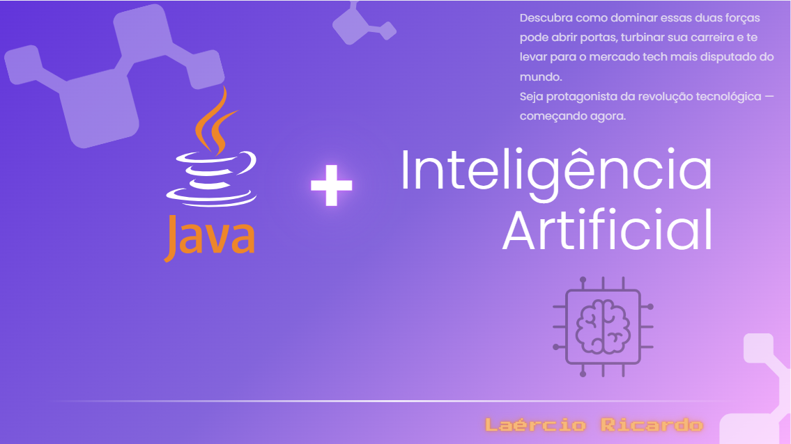
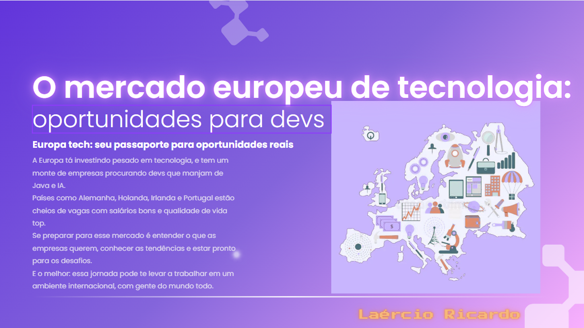

<div align="center">

# ☕🤖 Java + IA: Seu Passaporte para o Futuro na Europa  
**Java + AI: Your Passport to a Future in Europe**




</div>

---

## 🧠 Sobre o Projeto | About the Project

> 🌍 Um eBook com foco em **tecnologia de ponta**, carreira internacional e **visão de futuro**.  
> 🎯 Prático, direto ao ponto e com uma pegada visual marcante.

### 🇧🇷 Português  
Este eBook é para quem deseja crescer na carreira tech unindo **Java** e **IA**, com foco no mercado europeu.

### 🇬🇧 English  
This eBook is for those who want to grow in tech by combining **Java** and **AI**, focused on the European market.

---

## 📚 Conteúdo | Content

```text
📘 Introdução — Por que Java e IA são o passaporte para o seu futuro?
☕ O que é Java e por que aprender?
🤖 Introdução à Inteligência Artificial e suas aplicações
🌍 O mercado europeu de tecnologia: oportunidades para devs
🔧 Como combinar Java e IA no seu dia a dia profissional
🚀 Dicas para conquistar o mercado europeu
📈 Conclusão — Próximos passos para você começar hoje mesmo
🙏 Agradecimento
```

---

## 🖼️ Visual do Projeto

<div align="center">
  
  
  
</div>

---

## ⚙️ Tecnologias Utilizadas

<div align="center">


</div>

---

## 📥 Download

📘 [Clique aqui para baixar o PDF (PT-BR)](./ebook-java-ia.pdf)

> 💡 **Dica:** Para abrir em nova aba:  
> `Ctrl + clique` (Windows/Linux) ou `Cmd + clique` (Mac)

---

## 👨‍💻 Autor | Author

<div align="center">


### 💻 Laércio Ricardo

[](https://www.linkedin.com/in/laercioricardolima/)  
[](https://github.com/laercioricardolima)  
[](https://www.instagram.com/laercioricardoo)

</div>

---

## 💬 Feedback

Se gostou do projeto ou tem alguma sugestão, abra uma issue ou me chama no LinkedIn!

---

## ⭐ Dê uma estrela!

Se este projeto te ajudou ou inspirou, deixa uma ⭐ aqui no GitHub. Isso ajuda muito!

---

> ✨ _“A revolução tá rolando — e ela fala Java com sotaque europeu.”_ 🇪🇺💻  
> — **eBook Java + IA**
